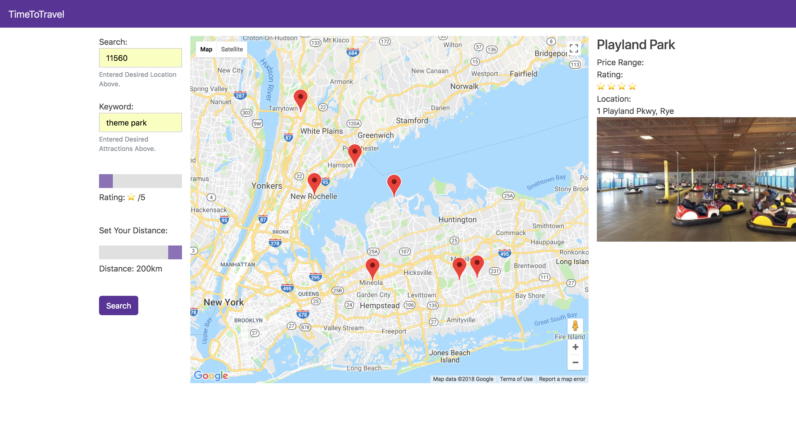

Setup/Development
Add wireframes to your github repo in a wireframes folder
Deployed link in readme
Screenshot of Landing page at top of readme below app name


## App name:

* Time To Travel

## Description:

* Currently there isn't a way to search an area for specific terms without also getting a large amount of unrelated suggestions.
* With Time To Travel you can search for things like "hiking" or "food" and you will only return these related items.
* Enables users to find locations very quickly and easily plan a weekend getaway.

## Setup

```sh
yarn # install dependencies
```

# Local Development

```sh
yarn start
```

# Deployment

```sh
yarn deploy
# or
firebase deploy
```

## Running the app
```sh
yarn start
```

## Building the app

```sh
yarn build
```

##Project Assets

* [Trello Board](https://trello.com/b/guGZ2U9h/mapproject)
* [Wireframes](https://www.draw.io/#G1HqeYI7dAOh9EvkQfrrwfvNp2VpZTpQpc)
